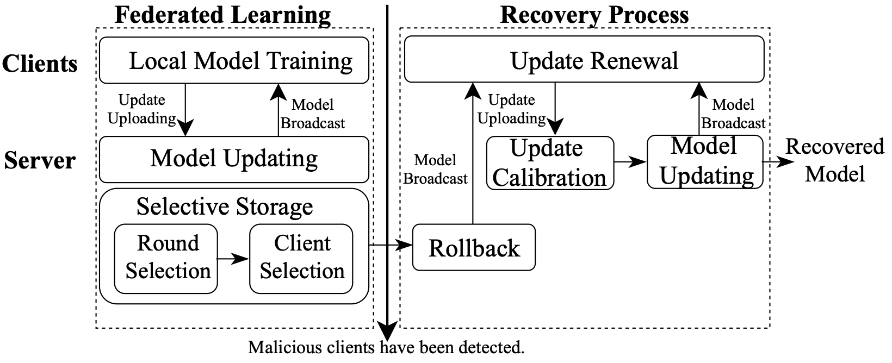

# Crab 🦀️ : Towards Efficient and Certified Recovery from Poisoning Attacks in Federated Learning

## About The Project
Official implementation of paper Crab. Crab can achieve efficient recovery from poisoning attacks through (i) selective storage of essential historical global models and clients' gradients rather than all historical information, and (ii) adaptive rollback to a global model that has not been significantly affected by the malicious clients rather than the initial model. 

📃 [[paper]](https://arxiv.org/abs/2401.08216)

<center></center>

## Setup
### Create a Conda Environment
```
git clone https://github.com/shenjiyuan123/Adaptive_Recovery.git
conda create -n Crab python=3.10
conda activate Crab
conda install pytorch==2.0.1 torchvision==0.15.2 pytorch-cuda=11.7 -c pytorch -c nvidia
```
### Install Other Dependencies
```
pip install -r requirements.txt
```

## Generate the dataset
For example, if want to generate the MNIST, you can use
```
python generate_mnist.py iid - -                # for iid and unbalanced scenario
python generate_mnist.py iid balance -          # for iid and balanced scenario
python generate_mnist.py noniid - pat           # for pathological noniid and unbalanced scenario   
python generate_mnist.py noniid - dir           # for practical noniid and unbalanced scenario
```
Note: the split file of train/test is 'add' mode, so notice to delete the original split files if you want to re-split the dataset.

## How to start the end-to-end recovery
For now, the support recovery algorithms includes **Retrain, FedEraser, FedRecover and Crab**. 

For example, to execute the `Crab` recovery simulation, run the following commands:
```python
python FedMoss.py       --algorithm Crab                \
                        --robust TrimmedMean            \
                        --verify_unlearn                \
                        --dataset mnist                 \
                        --global_rounds 40              \
                        --local_epochs 5                \   
                        --num_clients 20                \    
                        --unlearn_clients_number 10     \   
                        --select_round_ratio 0.6        \
                        --select_client_ratio 0.7       \  
```
Currently, we offer two types of attack: 
1. If you want to add the backdoor attack, need to add the argument `--backdoor_attack` and set the `--trigger_size 4`. Currently, can use the following combinations of backdoor settings:
    * `--label_inject_mode Fix` defines how to assign the labels to backdoor samples. `Fix`: assign all the backdoor samples to a fixed label, can use the `--tampered_label` to set the desired label. `Random`: assign tampered label randomly to each original label. `Exclusive`: perturb all the data with specific label and trigger. 
    * `clamp_to_little_range` when store true, it will use the [LIE attack](https://arxiv.org/abs/1902.06156).

2. If you want to add the trim attack, need to add the argument `--trim_attack` and set the `--trim_percentage` (default the percentage is 20).

Basic parameters:
- `dataset`: The name of experiment dataset, can choose **MNIST, Fashion-MNIST, CIFAR10/100 and AG News**.
- `global_rounds`: The communication rounds between clients and server.
- `local_epochs`: The training epochs of each clients. 
- `algorithm`: The recovery algorithm, can choose **Retrain, FedEraser, FedRecover and Crab**.  
- `robust`: The aggregation schemes (AGR) using when calculating the server parameters, can choose **FedAvg, Median, TrimmedMean, and Krum**.
- `verify_unlearn`: Whether use the MIA to verify the unlearning effectiveness.
- `num_clients`: The total number of clients.
- `unlearn_clients_number`: The targeted client number needed to be unlearned.
- `select_round_ratio`: The ratio of total round number selected in each time window.
- `select_client_ratio`: The ratio of total client number selected for each selected model.
---
For more detailed parameters setting, you can check the `FedMoss.py`. We offer a large number of parameter options. 

Additionally, the `run.sh` offers some command line samples that can run directly for the fast simulation.

## Acknowledge
This research is supported by the National Research Foundation, Singapore under its Strategic Capability Research Centres Funding Initiative. Any opinions, findings and conclusions or recommendations expressed in this material are those of the author(s) and do not reflect the views of National Research Foundation, Singapore.

Also, thanks to the repo of [PFLib](https://github.com/TsingZ0/PFLlib), which provides the wonderful foundation of FL framework.

## Citation
If you find the repo useful, please consider citing:
```
@article{jiang2024towards,
  title={Towards Efficient and Certified Recovery from Poisoning Attacks in Federated Learning},
  author={Jiang, Yu and Shen, Jiyuan and Liu, Ziyao and Tan, Chee Wei and Lam, Kwok-Yan},
  journal={arXiv preprint arXiv:2401.08216},
  year={2024}
}
```